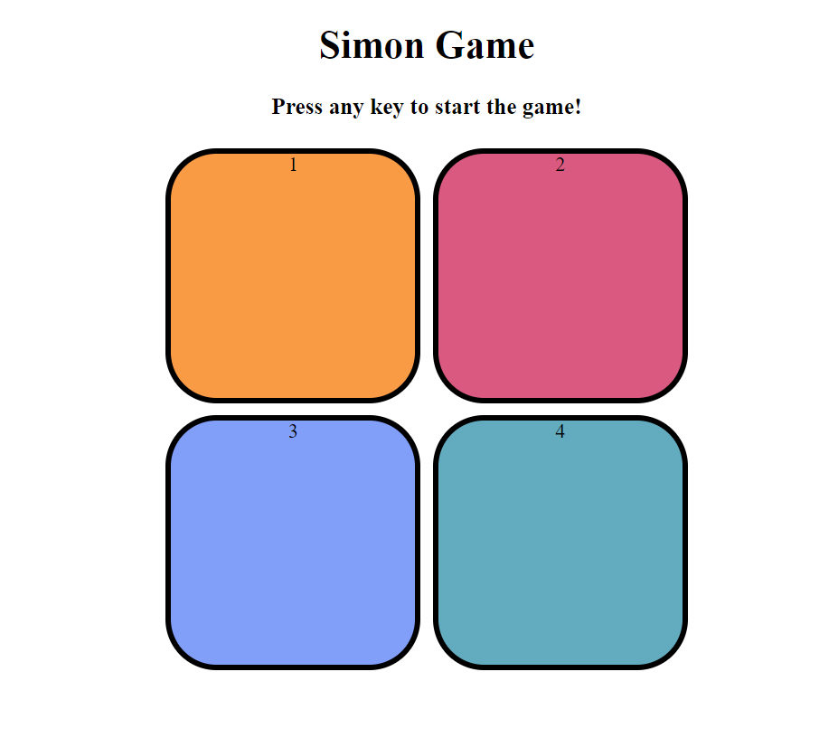

# Simon Says Game 🎮

## Overview

This project is a Simon Says game implemented using **HTML**, **CSS**, and **JavaScript**. The game challenges players to repeat a sequence of colors correctly. As the game progresses, the sequence becomes longer and more complex.

## Demo



## Features

- **Color Sequence:** The game displays a sequence of colors that players must repeat.
- **Score Tracking:** Players' scores increase with each correct sequence.
- **Responsive Design:** The game is designed to be playable on various devices.
- **Sound Effects:** Audio cues are provided for interactions and game events.

## Technologies Used

- **HTML5** - Structure and layout of the game interface.
- **CSS3** - Styling and visual design of the game elements.
- **JavaScript** - Game logic, sequence generation, and user interaction.

## Getting Started

### Prerequisites

Before you begin, ensure you have the following tools installed on your system:

- A modern web browser (e.g., Chrome, Firefox, Edge)
- A code editor (e.g., VSCode, Sublime Text)

### Installation

1. **Clone the repository:**
   ```bash
   git clone https://github.com/your-username/simon-say-game.git
   cd simon-say-game
